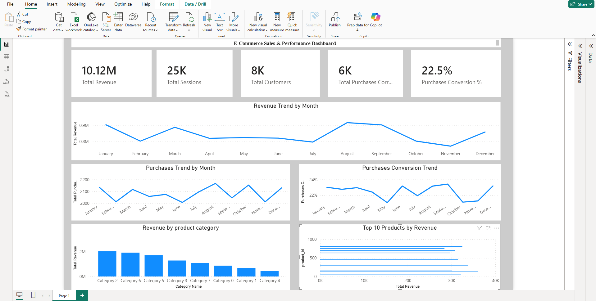

# Indian E-Commerce Sales Analysis

## 1. Project Overview

This project is an end-to-end e-commerce data analytics project focused on analyzing sales performance, customer behavior, product performance, marketing effectiveness, and category-level trends.

The project uses SQL for data analysis and Power BI for interactive data visualization and business intelligence.

## 2. Business Problem

The business needs to understand its e-commerce performance and identify the factors affecting revenue, customer activity, product performance, and marketing effectiveness.

The analysis focuses on answering questions such as:

- What are the overall sales and revenue trends?
- Which product categories generate the most revenue?
- Which products are the top performers?
- How do customers contribute to overall sales?
- How does marketing performance affect conversions?
- How does sales performance change over time?

## 3. Objectives

- Analyze overall e-commerce sales performance.
- Identify monthly revenue and sales trends.
- Analyze customer purchasing behavior.
- Evaluate marketing performance and conversion.
- Identify high-performing product categories.
- Identify top products by revenue.
- Perform data quality analysis.
- Build an interactive Power BI dashboard.
- Generate actionable business recommendations.

## 4. Dataset

The project uses an e-commerce sales dataset containing information related to customers, products, orders, sales, categories, marketing activity, and transaction performance.

The dataset was prepared and analyzed to support SQL-based business analysis and Power BI visualization.

## 5. Tools & Technologies

- **SQL** – Data cleaning, validation, transformation, and analysis
- **Power BI** – Dashboard development and visualization
- **DAX** – Measures and calculated metrics
- **Microsoft Excel / CSV** – Data preparation and source data
- **GitHub** – Project version control and documentation

## 6. Data Model

The project uses a structured data model to connect sales, customer, product, category, and marketing-related information.

The data model supports analysis across:

- Customers
- Products
- Categories
- Orders / Sales
- Marketing
- Date / Time

The relationships between these entities allow the Power BI dashboard to provide consistent and interactive analysis.

## 7. Data Cleaning

Data quality checks and preparation were performed before analysis.

The cleaning process included:

- Checking for missing values
- Identifying duplicate records
- Validating data types
- Checking sales and revenue values
- Validating categorical fields
- Checking date fields
- Reviewing inconsistent or invalid records
- Preparing the data for SQL analysis and Power BI

## 8. SQL Analysis

SQL was used to perform multiple business analyses.

The project includes:

### Data Quality Analysis
`01_data_quality.sql`

Used to validate data quality and identify potential issues in the dataset.

### Sales Analysis
`02_sales_analysis.sql`

Used to analyze overall sales and revenue performance.

### Monthly Analysis
`03_monthly_analysis.sql`

Used to identify monthly sales and revenue trends.

### Customer Analysis
`04_customer_analysis.sql`

Used to analyze customer-level purchasing behavior and contribution.

### Marketing Analysis
`05_marketing_analysis.sql`

Used to evaluate marketing performance and conversion-related metrics.

### Category Analysis
`06_category_analysis.sql`

Used to compare revenue and sales performance across product categories.

### Top Products Analysis
`07_top_products.sql`

Used to identify the highest-performing products based on revenue.

## 9. Power BI Dashboard

An interactive Power BI dashboard was developed to present the results of the analysis in a clear and business-friendly format.

The dashboard includes key metrics and visualizations such as:

- Total Revenue
- Total Sales
- Conversion Rate
- Revenue by Product Category
- Top 10 Products by Revenue
- Monthly Sales / Revenue Trends
- Customer Analysis
- Marketing Performance

The dashboard enables users to explore the business performance through interactive visualizations.

## 10. Key Insights

The analysis provides insights into:

- Overall revenue and sales performance
- Monthly sales trends
- High-performing product categories
- Top revenue-generating products
- Customer purchasing patterns
- Marketing and conversion performance
- Areas with opportunities for business improvement


## 11. Business Recommendations

Based on the analysis, the following business recommendations can be considered:

- **Investigate strong-performing months:** Analyze the factors behind strong August revenue performance and identify strategies that can be replicated in other months.
- **Improve lower-performing months:** Investigate the reasons behind lower November revenue and conversion performance and develop targeted improvement strategies.
- **Focus on high-performing categories:** Prioritize high-revenue product categories and strengthen inventory, pricing, and promotional strategies around them.
- **Promote top-performing products:** Use targeted campaigns and personalized promotions to increase visibility and sales of high-performing products.
- **Improve conversion performance:** Identify opportunities to improve conversion rates during lower-performing periods through better offers, customer experience, and marketing campaigns.
- **Retain high-value customers:** Analyze high-value customer behavior and develop personalized offers and retention strategies.
- **Optimize marketing channels:** Compare marketing channels based on revenue, conversion, and overall performance to allocate resources more effectively.
- **Use customer insights:** Leverage purchasing behavior to create targeted recommendations, offers, and campaigns.
- **Monitor performance continuously:** Track revenue, sales, conversion, category, product, and customer KPIs through the Power BI dashboard.
- **Maintain data quality:** Continue regular data validation and cleaning to ensure reliable business reporting and decision-making.

## 12. Project Structure

```text
Indian Ecommerce Analytics
│
├── ecommerce-sql
│   ├── 01_data_quality.sql
│   ├── 02_sales_analysis.sql
│   ├── 03_monthly_analysis.sql
│   ├── 04_customer_analysis.sql
│   ├── 05_marketing_analysis.sql
│   ├── 06_category_analysis.sql
│   └── 07_top_products.sql
│
├── screenshots
│   └── dashboard.png
│
└── README.md

## Conclusion

This project demonstrates an end-to-end data analytics workflow using PostgreSQL, SQL, and Power BI.

The workflow covers data validation, SQL-based analysis, KPI development, business analysis, dashboard creation, and insight generation.

## Author

Harsh

GitHub: https://github.com/Hasrh2807

## Power BI Dashboard




